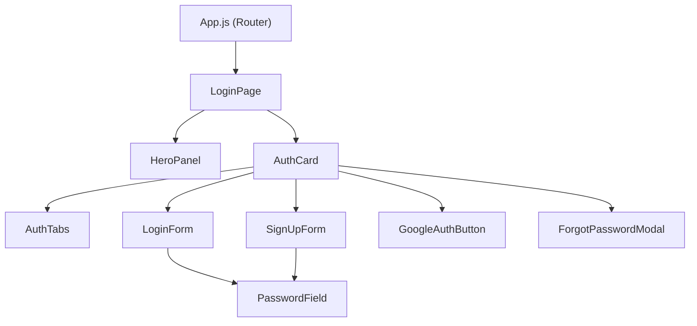

# Design Document: Responsive UI Login

## Overview

CivicWay's login page is a React-based, fully responsive authentication UI. It uses a split-screen layout: a branded hero panel on the left and an auth card on the right. The auth card supports tab-based switching between Login and Sign Up, credential-based login, Google OAuth via `@react-oauth/google`, a Forgot Password modal, and legal links. The layout adapts across three breakpoints (desktop ≥1025px, tablet 601–1024px, mobile ≤600px) using CSS media queries.

---

## Architecture

The feature is a pure frontend React implementation with no backend integration in scope. Routing is handled by registering `LoginPage` as the default route in `App.js`. Google OAuth is delegated entirely to the `@react-oauth/google` library.



### Responsive Behavior

| Breakpoint | Layout |
|---|---|
| Desktop (≥1025px) | Two-column split: HeroPanel left, AuthCard right |
| Tablet (601–1024px) | Single column: HeroPanel stacked above AuthCard |
| Mobile (≤600px) | AuthCard only, full viewport width; HeroPanel hidden from DOM |

---

## Components and Interfaces

### `LoginPage` — `frontend/src/pages/LoginPage.jsx`

Top-level page component. Renders the split-screen shell and composes `HeroPanel` and `AuthCard`.

```jsx
// No props — renders full-page layout
<LoginPage />
```

### `HeroPanel` — `frontend/src/components/HeroPanel.jsx`

Left panel. Renders background image, dark overlay, tagline, and quote box. Hidden at mobile breakpoint via CSS (`display: none`).

```jsx
// No props — static branded content
<HeroPanel />
```

### `AuthCard` — `frontend/src/components/AuthCard.jsx`

Right panel card. Manages the active tab state (`'login' | 'signup'`) and renders `AuthTabs`, the active form, `GoogleAuthButton`, `ForgotPasswordModal`, and legal links.

```jsx
// Internal state: activeTab, isForgotPasswordOpen
<AuthCard />
```

### `AuthTabs` — `frontend/src/components/AuthTabs.jsx`

Tab toggle between Login and Sign Up.

```jsx
<AuthTabs activeTab="login" onTabChange={(tab) => {}} />
// Props:
//   activeTab: 'login' | 'signup'
//   onTabChange: (tab: 'login' | 'signup') => void
```

### `LoginForm` — `frontend/src/components/LoginForm.jsx`

Credential login form. Manages its own field state and inline validation.

```jsx
<LoginForm onForgotPassword={() => {}} />
// Props:
//   onForgotPassword: () => void  — opens ForgotPasswordModal
```

### `SignUpForm` — `frontend/src/components/SignUpForm.jsx`

Registration form with placeholder fields (name, email, password, confirm password).

```jsx
// No props — manages own field state and validation
<SignUpForm />
```

### `PasswordField` — `frontend/src/components/PasswordField.jsx`

Reusable password input with visibility toggle.

```jsx
<PasswordField
  id="password"
  label="Password"
  value={value}
  onChange={(e) => {}}
/>
// Props:
//   id: string
//   label: string
//   value: string
//   onChange: React.ChangeEventHandler<HTMLInputElement>
```

### `GoogleAuthButton` — `frontend/src/components/GoogleAuthButton.jsx`

Wraps `@react-oauth/google`'s `GoogleLogin` component with CivicWay styling.

```jsx
<GoogleAuthButton onSuccess={(credentialResponse) => {}} onError={() => {}} />
// Props:
//   onSuccess: (credentialResponse: CredentialResponse) => void
//   onError: () => void
```

### `ForgotPasswordModal` — `frontend/src/components/ForgotPasswordModal.jsx`

Modal overlay for password reset. Triggered from `LoginForm` via `AuthCard` state.

```jsx
<ForgotPasswordModal isOpen={false} onClose={() => {}} />
// Props:
//   isOpen: boolean
//   onClose: () => void
```

---

## Data Models

### UI State (AuthCard)

```ts
type ActiveTab = 'login' | 'signup';

interface AuthCardState {
  activeTab: ActiveTab;
  isForgotPasswordOpen: boolean;
}
```

### LoginForm State

```ts
interface LoginFormState {
  usernameOrEmail: string;
  password: string;
  errors: {
    usernameOrEmail?: string;
    password?: string;
  };
}
```

### SignUpForm State (placeholder)

```ts
interface SignUpFormState {
  name: string;
  email: string;
  password: string;
  confirmPassword: string;
  errors: {
    name?: string;
    email?: string;
    password?: string;
    confirmPassword?: string;
  };
}
```

### PasswordField State

```ts
interface PasswordFieldState {
  isVisible: boolean; // false = type="password", true = type="text"
}
```

### Google OAuth

The `@react-oauth/google` library handles the OAuth flow. The app receives a `CredentialResponse` on success containing a JWT `credential` string. No custom token model is defined in this UI-only scope.

---

## Correctness Properties

*A property is a characteristic or behavior that should hold true across all valid executions of a system — essentially, a formal statement about what the system should do. Properties serve as the bridge between human-readable specifications and machine-verifiable correctness guarantees.*

### Property 1: Tab state controls form visibility

*For any* `AuthCard`, when the active tab is `'login'`, `LoginForm` must be present in the rendered output and `SignUpForm` must be absent; when the active tab is `'signup'`, `SignUpForm` must be present and `LoginForm` must be absent.

**Validates: Requirements 4.2, 4.3**

---

### Property 2: Active tab has distinct style

*For any* `AuthTabs` rendered with a given `activeTab` value, the active tab element must have a CSS class that is different from the CSS class on the inactive tab element.

**Validates: Requirements 4.4**

---

### Property 3: Keyboard activates tab

*For any* `AuthTabs`, pressing Enter or Space while a tab button is focused must invoke the `onTabChange` callback with that tab's value.

**Validates: Requirements 4.5**

---

### Property 4: LoginForm submit validates required fields

*For any* activation of the "Login to Portal" button where either the username/email field or the password field is empty, the `LoginForm` must display an inline validation error for each empty field and must not submit.

**Validates: Requirements 5.6, 5.7**

---

### Property 5: LoginForm submits correct values

*For any* non-empty username/email string and non-empty password string, activating the "Login to Portal" button must trigger form submission with exactly those values.

**Validates: Requirements 5.5**

---

### Property 6: PasswordField toggle changes input type

*For any* `PasswordField`, activating the visibility toggle must change the input `type` from `"password"` to `"text"` (when currently hidden) or from `"text"` to `"password"` (when currently visible). Toggling twice must return the input to its original `type`.

**Validates: Requirements 6.2, 6.3**

---

### Property 7: PasswordField toggle aria-label reflects state

*For any* `PasswordField` in hidden state, the toggle button's `aria-label` must indicate "Show password"; in visible state it must indicate "Hide password".

**Validates: Requirements 6.4**

---

### Property 8: GoogleAuthButton present in both tab views

*For any* `AuthCard` regardless of active tab (`'login'` or `'signup'`), the `GoogleAuthButton` must be present in the rendered output.

**Validates: Requirements 7.4**

---

### Property 9: GoogleAuthButton initiates OAuth on activation

*For any* `GoogleAuthButton`, activating it must invoke the OAuth initiation handler (i.e., the `onSuccess`/`onError` callbacks wired to `@react-oauth/google`'s `GoogleLogin`).

**Validates: Requirements 7.3**

---

### Property 10: Legal links are anchors with accessible text

*For any* legal link rendered in `AuthCard` (Terms of Service, Privacy Policy), the element must be an `<a>` tag with a non-empty, descriptive `textContent` or `aria-label`.

**Validates: Requirements 8.4**

---

## Error Handling

| Scenario | Behavior |
|---|---|
| Empty username/email on login submit | Inline error: "Username or email is required" |
| Empty password on login submit | Inline error: "Password is required" |
| Google OAuth error callback | Display a user-facing error message (e.g., "Google sign-in failed. Please try again.") |
| Google OAuth library not initialized | `GoogleAuthButton` renders in a disabled/fallback state |
| Forgot Password modal — empty email | Inline error: "Email is required" |

Error messages are displayed inline, adjacent to the relevant field or button. No page navigation occurs on error.

---

## Testing Strategy

### Dual Testing Approach

Both unit tests and property-based tests are required. They are complementary:

- **Unit tests** cover specific examples, integration points, and edge cases (e.g., "does the LoginPage render HeroPanel at desktop?", "does the Terms link have the correct href?").
- **Property tests** verify universal behaviors across all valid inputs (e.g., "for any tab state, the correct form is shown").

### Unit Tests

Focus areas:
- Rendering: verify presence of key elements (logo, tagline, tabs, form fields, buttons, links) — covers Requirements 1.1–1.3, 2.2, 2.3, 2.5, 3.1, 3.2, 4.1, 5.1–5.4, 6.1, 7.1, 7.2, 8.1–8.3
- File structure: verify component and CSS files exist at correct paths — covers Requirement 10
- Route registration: verify `LoginPage` is rendered at the root route in `App.js` — covers Requirement 10.4
- Edge cases: empty form submission, modal open/close, OAuth error state

Use `@testing-library/react` (already in `package.json`) for all unit tests.

### Property-Based Tests

Use **fast-check** as the property-based testing library.

Install: `npm install --save-dev fast-check`

Each property test must run a minimum of **100 iterations**.

Each test must include a comment tag in the format:
`// Feature: responsive-ui-login, Property {N}: {property_text}`

| Property | Test Description |
|---|---|
| Property 1 | Generate random tab values; assert correct form visibility |
| Property 2 | Generate random tab values; assert active tab has distinct CSS class |
| Property 3 | Simulate keyboard events on tabs; assert callback invoked |
| Property 4 | Generate empty/whitespace field combinations; assert validation errors shown |
| Property 5 | Generate arbitrary non-empty strings; assert submission called with correct values |
| Property 6 | Generate arbitrary PasswordField states; assert toggle changes type correctly and round-trips |
| Property 7 | Generate arbitrary PasswordField states; assert aria-label matches visibility state |
| Property 8 | Generate arbitrary tab values; assert GoogleAuthButton always present |
| Property 9 | Simulate GoogleAuthButton activation; assert OAuth handler called |
| Property 10 | Generate arbitrary legal link renders; assert anchor with non-empty text |

### Test File Locations

```
frontend/src/
  components/
    __tests__/
      AuthCard.test.jsx
      AuthTabs.test.jsx
      LoginForm.test.jsx
      SignUpForm.test.jsx
      PasswordField.test.jsx
      GoogleAuthButton.test.jsx
      ForgotPasswordModal.test.jsx
      HeroPanel.test.jsx
  pages/
    __tests__/
      LoginPage.test.jsx
```
